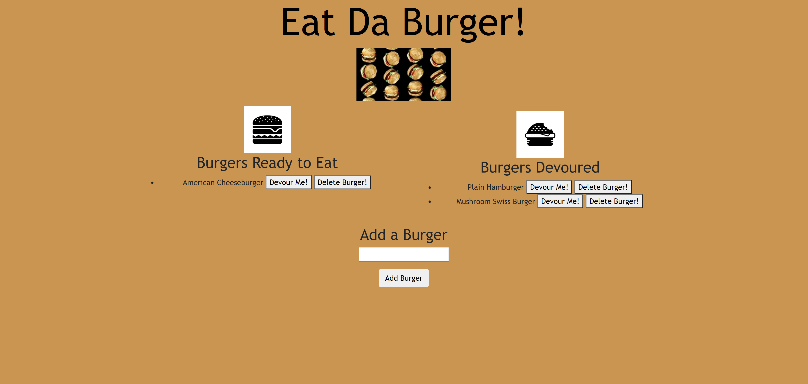

# Eat-Da-Burger
## Description
    Burger is an app that allows users to add a burger. Once added, the added burger appears under Burgers Ready to Eat. 
    Buttons are attached to each burger, giving the user the ability to select Devour Me or Delete Me.

    Here are some of the technologies that were used to the create this program:
    JavaScript, CSS, Node.js, Express, Handlebars
    
## Table of Contents
    * [Installation](#installation)
    * [Live_Link](#live_link)
    * [Questions](#questions)
    * [License](#license)
    
## Installation
    Use http://localhost:8000 only after completing the following steps
    git clone git@github.com:ShaniBlack/burger.git 
    cd burger
    npm install
    node server.js

## Live_Link
    Eat-Da-Burger is hosted on Heroku: https://polar-earth-99608.herokuapp.com
    Github link: https://github.com/ShaniBlack/burger

## Questions
    Please feel free to find me on GitHub: ShaniBlack https://github.com/ShaniBlack
    You can also email me at shaniblack2004@gmail.com with any questions.

## License
    This application is covered by the MIT License license.
  
